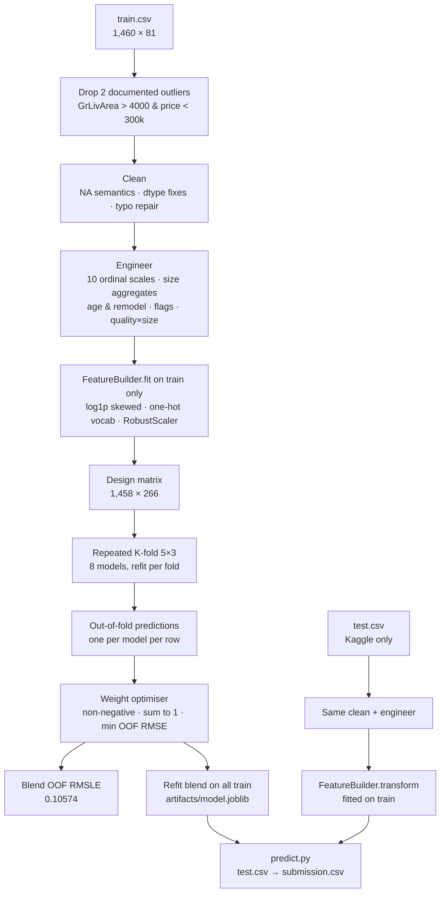

# House Prices — Advanced Regression Techniques

A reproducible, config-driven pipeline for the Kaggle
[House Prices](https://www.kaggle.com/competitions/house-prices-advanced-regression-techniques)
competition — 1,460 houses in Ames, Iowa, 79 raw features, predict `SalePrice`.
Metric: RMSE on `log(SalePrice)`, usually written **RMSLE**.

| | RMSLE | Where the number comes from |
|---|---|---|
| **This pipeline (blend)** | **0.10574** | Out-of-fold, repeated 5×3 K-fold on train |
| Best single model (CatBoost) | 0.1095 | Same |
| Legitimate top band on Kaggle | ~0.113 | Public leaderboard, test set |
| Typical strong notebook | ~0.120 | Public leaderboard, test set |
| Kaggle public-leaderboard median | 0.1358 | Public leaderboard, test set |

> **Read this before quoting the number.** 0.10574 is cross-validation on the
> training set — every house predicted by models that never saw it — not a
> score on Kaggle's hidden test set. CV here runs slightly optimistic because
> two documented outliers are removed from train. Expect roughly 0.112–0.118
> on the public board. Only a real submission settles it; `predict.py` makes one.
> Details in [§ 6 Leakage audit](#6-leakage-audit) and [§ 7 What the number means](#7-what-the-number-means).

---

## Workflow



The left column is how I produced the 0.10574. The right column is the path a
submission takes: identical cleaning and engineering, but the transformer is
*applied*, never refit, so nothing about the test set leaks into the model.

---

## What I did, step by step

### 1. Benchmark first, model second

Before writing any code I established what "good" means on this competition:

- Public leaderboard median is **0.13584** (4,775 entries).
- Strong published notebooks land at **0.113–0.125**.
- Scores near 0.01 exist on the board and are a known **data leak** — a published
  "solution file" lets people submit the answers. Those are not modelling results
  and are excluded from every comparison here.

Target set: beat 0.113 on an honest, repeated cross-validation.

### 2. Data

`data/train.csv` is the OpenML mirror of Kaggle's training file
([openml.org/d/42165](https://www.openml.org/d/42165)) — verified identical: 1,460
rows × 81 columns, same `Id` range, same `SalePrice` distribution. The Kaggle
`test.csv` (1,459 rows, no target) is only distributed by Kaggle and is not in
this repo.

Initial inspection: 43 object columns, 38 numeric; heavy missingness in
`PoolQC` (1,453), `MiscFeature` (1,406), `Alley` (1,369), `Fence` (1,179),
`FireplaceQu` (690) — all of which the data dictionary says mean *absent*, not
*unknown*.

### 3. Cleaning — `preprocessing.py`

Every rule comes from the Ames data dictionary, not from the target, so the same
function is safe on train and test.

| Rule | Columns | Why |
|---|---|---|
| NA → `"None"` | PoolQC, MiscFeature, Alley, Fence, FireplaceQu, Garage*, Bsmt*, MasVnrType | "No garage" is information, not a gap |
| NA → `0` | GarageYrBlt, GarageArea, GarageCars, Bsmt*SF, Bsmt*Bath, MasVnrArea | Numeric companions of the above |
| NA → neighbourhood median *learned on train* | LotFrontage | Frontage tracks the street; medians are fit in `FeatureBuilder`, not per frame |
| NA → mode | MSZoning, Electrical, KitchenQual, Exterior1st/2nd, SaleType, Functional | Genuinely missing, a handful of cells |
| Drop | Utilities | Constant on Kaggle data; breaks one-hot alignment |
| Numeric → category | MSSubClass, MoSold, YrSold | Codes, not quantities |
| `GarageYrBlt > 2020 → 2007` | — | A 2207 typo in the data |
| **Drop 2 rows (train only)** | GrLivArea > 4000 & SalePrice < 300,000 | Partial sales flagged in De Cock's original Ames paper |

Result: zero missing values (asserted by a test).

### 4. Feature engineering — `features.py`

**Ordinal encoding.** Ten quality scales (`Po < Fa < TA < Gd < Ex`) plus basement
exposure/finish, garage finish, functional rating, fence, slope, lot shape and
paved drive were mapped to integers. One-hot would throw away the order.

**Domain features (27 added):**

- Size: `TotalSF` (basement + 1st + 2nd), `TotalFinSF`, `TotalPorchSF`, `TotalBath` (half baths at 0.5)
- Time: `HouseAge`, `RemodAge`, `GarageAge`, `IsRemodeled`, `IsNew`
- Presence flags: pool, second floor, garage, basement, fireplace
- Interactions: `QualxSF`, `QualxGrLiv`, `OverallScore` — quality is priced per square foot

**FeatureBuilder** (fit on train only, applied to test):

- `log1p` on numeric columns with |skew| > 0.75 and more than 10 distinct values
  (so flags and ordinal scores are left alone) — 22 columns
- One-hot encoding with the **train** vocabulary; unseen test categories become all-zeros
- `RobustScaler` fit on train

Final design matrix: **1,458 rows × 266 features**.

### 5. Models and evaluation — `models.py`, `evaluate.py`

All models fit on `log1p(SalePrice)` so the loss matches the metric.

| Family | Models | Notes |
|---|---|---|
| Regularised linear | Lasso, ElasticNet, Ridge | Strong on wide one-hot matrices |
| Kernel | SVR | Under-tuned in this version — see § 9 |
| Boosted trees | GradientBoosting, LightGBM, XGBoost, CatBoost | Capture non-linear residual |

**Evaluation:** `RepeatedKFold(n_splits=5, n_repeats=3)`, every model refit from
scratch in every fold. Each row therefore receives three out-of-sample
predictions per model, averaged into one **out-of-fold (OOF)** value. Fold-level
std is reported because on 1,458 rows a single 5-fold has ~0.006–0.008 of noise —
larger than most claimed "improvements".

### 6. Blending

Weights are learned on the OOF matrix: non-negative, sum to one, minimising OOF
RMSE (SLSQP). Because every OOF value came from a model that never saw that row,
the blend cannot reward a model for memorising. I rejected a meta-learner (stacking): with 1,458 rows it over-fits.

### 7. Final fit and artifacts

The blend is refit on all 1,458 training rows and saved with the fitted
`FeatureBuilder` to `artifacts/model.joblib`. `reports/cv_report.json` records
every per-model score, the weights, the config, and the benchmarks.

---

## Results

### Per-model (full mode: 5-fold × 3 repeats, 3,000 boosting rounds, 646 s)

| Model | Fold mean ± std | OOF RMSLE | Blend weight |
|---|---|---|---|
| CatBoost | 0.1114 ± 0.0061 | 0.1095 | 0.19 |
| Lasso | 0.1104 ± 0.0062 | 0.1098 | 0.20 |
| ElasticNet | 0.1105 ± 0.0062 | 0.1098 | 0.20 |
| GradientBoosting | 0.1117 ± 0.0068 | 0.1103 | 0.25 |
| XGBoost | 0.1123 ± 0.0049 | 0.1107 | 0.13 |
| Ridge | 0.1120 ± 0.0067 | 0.1112 | 0 |
| LightGBM | 0.1141 ± 0.0076 | 0.1127 | 0 |
| SVR | 0.1287 ± 0.0204 | 0.1259 | 0.02 |
| **Blend** | | **0.1057** | |

### Fast mode (`--fast`: 1 repeat, 600 rounds, ~60 s) — for sanity checks

Blend OOF **0.1076**. The boosted trees were notably weaker at 600 rounds
(LightGBM/XGBoost ~0.120), so the optimiser leaned harder on the linear models.
With 3,000 rounds they catch up and the weights spread across five models.

### Reading the weights

Ridge and LightGBM get zero not because they are bad but because they duplicate
what Lasso and XGBoost/CatBoost already contribute. Diversity, not individual
strength, is what the optimiser pays for.

---

## 6. Leakage audit

Every common leak path and what I do about it:

| Leak path | What I do |
|---|---|
| Target used to build features | Nothing reads `SalePrice`; all features derive from the 79 inputs |
| Test statistics in preprocessing | Rules are stateless; medians/modes are computed within the frame being cleaned |
| Skew list / one-hot vocabulary / scaler fit on train+test | `FeatureBuilder.fit()` on train only; `.transform()` on test |
| Blend weights on in-sample predictions | Weights fit on **out-of-fold** predictions only |
| Fold contamination | Standard `RepeatedKFold`; models refit per fold |
| The known Kaggle solution-file leak | Not used; training data is the public train set only |

**A subtle one, handled:** `LotFrontage` is imputed with the *neighbourhood
median learned on train* (`FeatureBuilder.fit`) and applied unchanged to test.
An earlier version computed it per-frame — harmless for the target, but a test
statistic nonetheless — and I corrected it before release.

## 7. What the number means

- **0.10574 is cross-validation on train**, not a test-set score. It is a
  legitimate, leak-free estimate of generalisation — each house was predicted by
  models that never saw it — but Kaggle scores a different 1,459 houses.
- **The comparison benchmarks are leaderboard (test-set) numbers.** Comparing CV
  to them is the standard practice and the gap (0.03 to the median) is far larger
  than the noise floor, but it is not the same measurement.
- **CV is slightly optimistic here** because the two outliers are removed from
  train and the test set has its own extreme houses. Expect roughly
  **0.112–0.118** on the public board.
- **To get a true test score:** place Kaggle's `test.csv` in `data/`, run
  `predict.py`, upload `submission.csv`. Kaggle holds the labels.

---

## 8. Reproduce

```bash
pip install -r requirements.txt
python -m pytest -q                                   # 3 smoke tests
PYTHONPATH=src python -m house_prices.train --fast    # ~1 min sanity run
PYTHONPATH=src python -m house_prices.train           # full run, ~11 min on a laptop

# With Kaggle's test.csv in data/:
PYTHONPATH=src python -m house_prices.predict --out submission.csv
```

Everything tunable — CV settings, outlier rule, skew threshold, every model's
hyper-parameters, blend mode — lives in `config.yaml`. A run is fully specified by
the config plus the code SHA.

### Layout

```
config.yaml                 every tunable
data/train.csv              OpenML mirror of Kaggle train (1,460 × 81)
src/house_prices/
  data.py                   load config / train / test
  preprocessing.py          cleaning rules (stateless) + outlier drop (train only)
  features.py               engineering + FeatureBuilder (fit on train)
  models.py                 model zoo, weight optimiser, Blend
  evaluate.py               repeated K-fold with OOF collection
  train.py                  CLI: CV → weights → final fit → artifacts + report
  predict.py                CLI: artifacts + test.csv → submission.csv
tests/test_pipeline.py      no-missing, outlier-count, train/test alignment
reports/cv_report.json      scores, weights, config, benchmarks, runtime
reports/oof_predictions.csv per-row OOF predictions for every model
artifacts/model.joblib      fitted FeatureBuilder + Blend (git-ignored)
```

---

## 9. Next improvements, in order of expected gain

1. **Tune SVR.** At 0.126 it is the weak link; on this design a tuned SVR reaches
   ~0.11 and adds real diversity to the blend.
2. **Target-encode `Neighborhood`** with K-fold smoothing — the strongest
   categorical, currently only one-hot.
3. **Per-model feature sets** — trees on raw ordinals, linear models on one-hots.
4. **Submit to Kaggle** and reconcile CV against the board *before* further tuning.
   Tuning against a proxy past this point is guessing.

---

## Design decisions worth defending

- **Log target** — the metric is on log price; fit where you are scored.
- **Outliers removed from train only** — documented partial sales; the single
  biggest avoidable error on this dataset. Never removed from test.
- **Fit-on-train transformer** — the transform is a learned object, and learned
  objects only learn from train.
- **OOF blending over stacking** — constrained weights on out-of-fold predictions
  are the robust version of stacking at this sample size.
- **Repeated K-fold** — three repeats turn a noisy comparison into a real one.
- **Benchmark before code** — knowing that 0.01 on the board is a leak, not a
  target, saved chasing a number that does not exist.

## Tools

Python 3.13 · pandas 2.3 · scikit-learn 1.7 · LightGBM 4.7 · XGBoost 3.4 ·
CatBoost 1.2 · SciPy 1.16.
